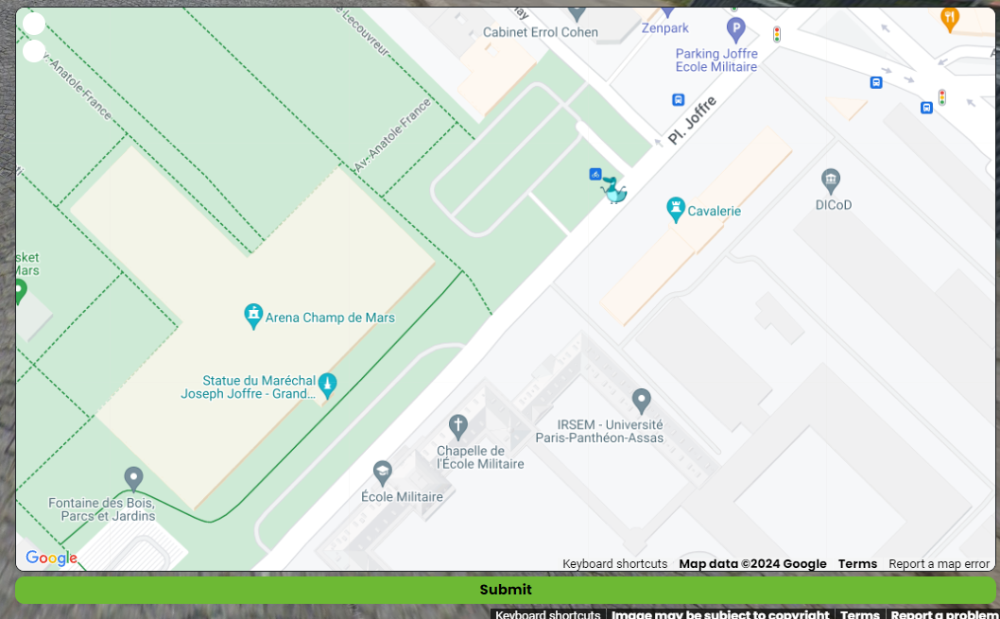
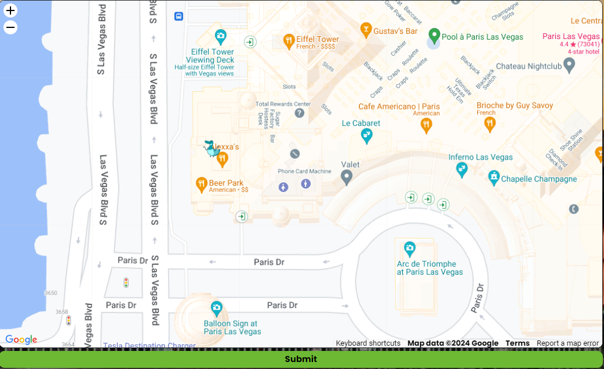
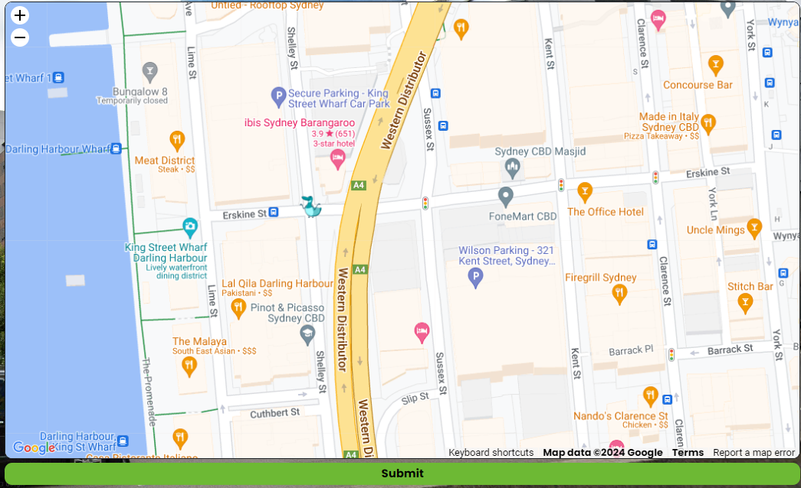
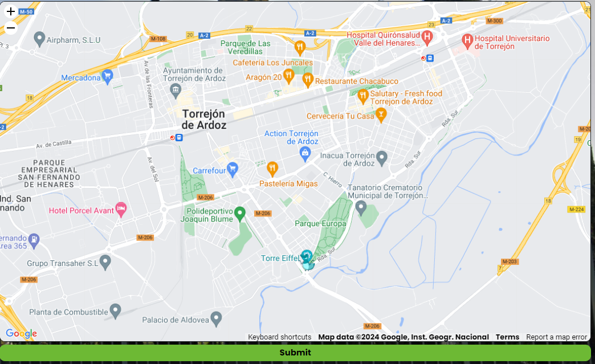
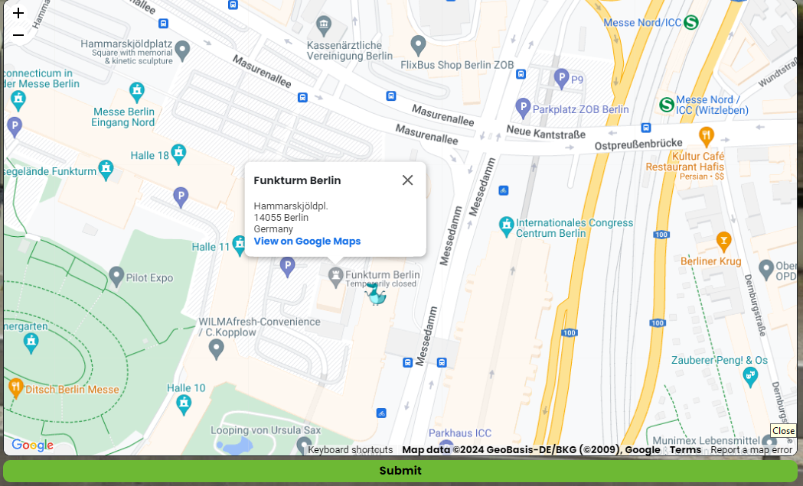
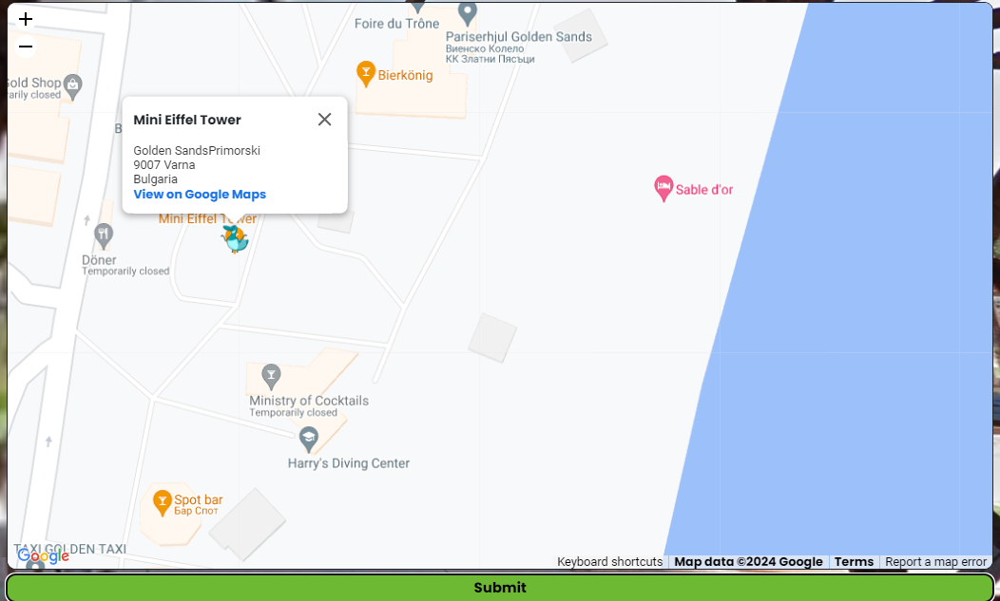
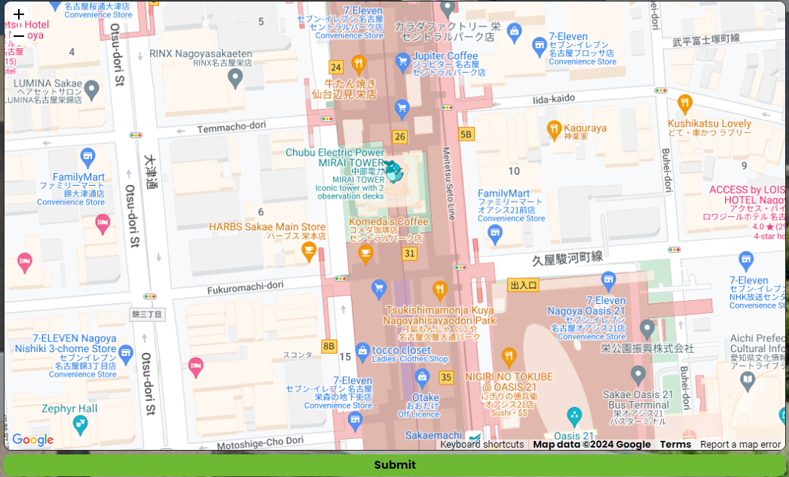

# bonaparte_1784
I immediately saw the Eiffel Tower in the background so it was a simple look around on Google Maps. 

**Flag 1:** 1,1e3f2a0309b777b37b1bc12d01203339

# beer_park
I identified alexxias bar, it was obvious it was within las vegas. I simply searched 'alexxias bar Las vegas' and was directed to the location on Google Maps.

**Flag 2:** 2,ec72b5bdb83f858308142a0d3dde5714

# mr_drains
So we're dropped on a motorway in a city landscape. The van beside us has the text "MR Drains" painted on the side. So I search "mr drains plumbing" from the van seen

So now we have the location Sydney. Now I can have a look at the company branded sky scrapers. I identified 'myob' company building beside an ibis hotel. I can simply google Myob Sydney, and find the site that is opposite an ibis hotel. 

**Flag 3:** 3,c82846bd8de1579487c290fe0ef30700

green_car
'atencion' sign = spanish
we see a monoment that resemables the effiel tower
search effiel tower replicas spain
https://www.wonders-of-the-world.net/Eiffel-Tower/Repliques/Replicas-of-the-Eiffel-tower-in-Spain.php
'Torrejon' city 'Torre Eiffel'

4,399a088ff464a1a43ed3d6864c7f50b5

posuto_py
japanese lettering (seen via 'JP' Post)
search 'Mita Garden hills' (seen on building) Japan
located near tokyo tower - effil replica

5,fc26a083d35cb9d6b474580017f8bdfa

icc
Germany - from language seen on building 'das neue'
see 'Funkturm Restaurant' 
search it - located in Berlin

6,836c35892e7643f71668376d1716e44e

imax
we see another effil tower replica
beside a retail park

all_eyes_on_us
we are under the effil replica
english spelling
search aldo supermarket -> bulgarian chain
i remember looking at a effiel replica from bulgaria in the article
its the same one

8,158686d31f2b18c862c765f95c336a0b

panasonic
modern replica of effiel seen, look at article
asian country due to lettering seen
located next to 'Hisayaodori park' seen in map images
search it -> Nagoya city

9,a1e3b275a3e73cd964ffd840063204be

deja_vu
we see a chimney, a church tower and a company building named 'Tallink'
we see a signpost with 'kalamaja' -  a neighbourhood in estonia
search kalamaja chimney -> part of the former Tallinn Power Plant
10,201189c04aae837ab90f86c9d5747beb

flag1 = b'idek{very_iconic_tower_75029e39}'