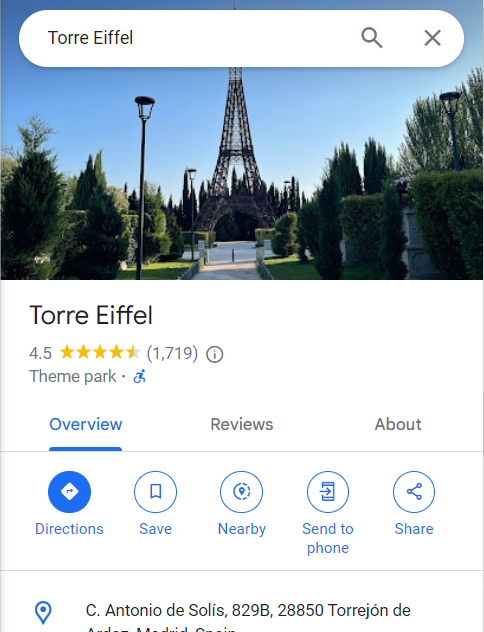
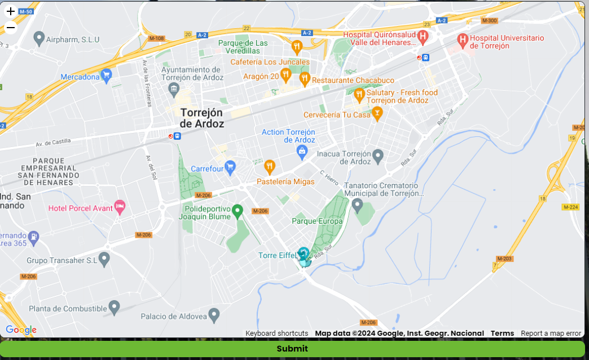
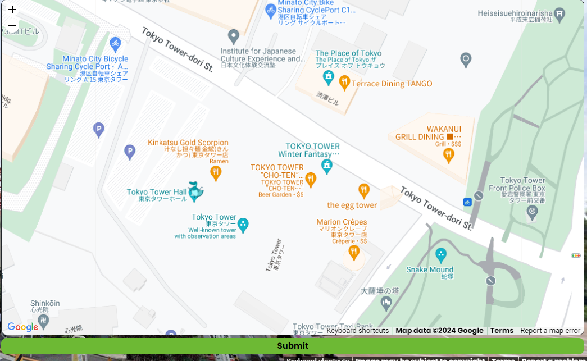
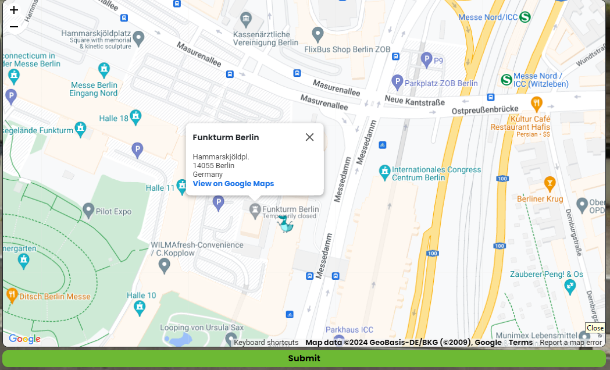
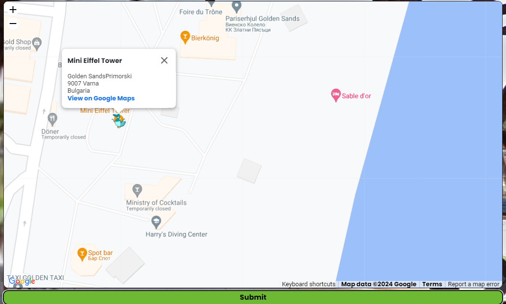
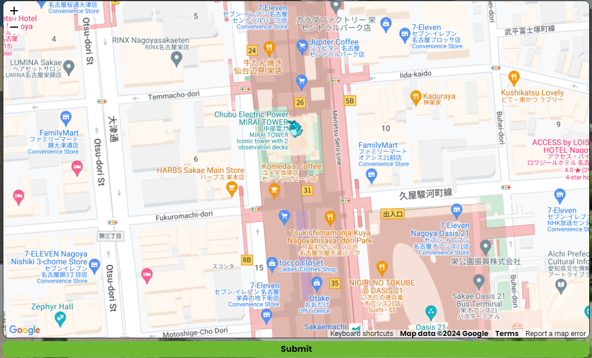

# bonaparte_1784
I immediately saw the Eiffel Tower in the background so it was a simple look around on Google Maps. 

**Flag 1:** 1,1e3f2a0309b777b37b1bc12d01203339

# beer_park
I identified alexxias bar, it was obvious it was within las vegas. I simply searched 'alexxias bar Las vegas' and was directed to the location on Google Maps.

**Flag 2:** 2,ec72b5bdb83f858308142a0d3dde5714

# mr_drains
So we're dropped on a motorway in a city landscape. The van beside us has the text "MR Drains" painted on the side. So I search "mr drains plumbing" from the van seen

So now we have the location Sydney. Now I can have a look at the company branded sky scrapers. I identified 'myob' company building beside an ibis hotel. I can simply google Myob Sydney, and find the site that is opposite an ibis hotel. 

**Flag 3:** 3,c82846bd8de1579487c290fe0ef30700

# green_car
We can see a sign stated 'atencion'. Googling tells me this is spanish, so I've already identified it's a spanish speaking country. I can see a monoment that resemables the Eiffel tower to the side. I search for Eiffel tower replicas located in Spain. Sure enough, there are whole articles detailing these replicas so i just had to go down the list *https://www.wonders-of-the-world.net/Eiffel-Tower/Repliques/Replicas-of-the-Eiffel-tower-in-Spain.php*. 

So I know this is 'Torrejon' city 'Torre Eiffel'. I simply search this on maps, and I get the location.

**Flag 4:** 4,399a088ff464a1a43ed3d6864c7f50b5

# posuto_py
From the japanese lettering (seen via 'JP' Post), I know we are in Japan. The building at the side has its name printed on the side. So I search 'Mita Garden hills' (seen on building) Japan. It is located near tokyo tower - another Eiffel replica! Some simple zooming around gets us the exact location.

**Flag 5:** 5,fc26a083d35cb9d6b474580017f8bdfa

# icc
Already I know this location is within Germany, from language seen on building 'das neue'. At the side we can see 'Funkturm Restaurant'. By searching it we find it is exactly located in Berlin. 

**Flag 6:** 6,836c35892e7643f71668376d1716e44e

# imax
We see another Eiffel Tower replica beside a retail park and cinema. I can't make out the lettering as the image is too blurry so i decide to move on instead of going through every Eiffel Tower replica in existance.

# all_eyes_on_us
We are under the a Eiffel replica. There is english spelling seen. I see and search for aldo supermarket. i find out it is a bulgarian chain. So now we know we are in Bulgaria. I remember looking at a Eiffel replica from bulgaria in the article quoted above. Its the same one!

**Flag 8:** 8,158686d31f2b18c862c765f95c336a0b

# panasonic
A modern replica of Eiffel seen in the distance, I look at the article again. It is an asian country due to lettering seen. I quickly find it is located next to 'Hisayaodori park' seen in map image. I search it and find the it is within Nagoya city.

**Flag 9:** 9,a1e3b275a3e73cd964ffd840063204be

# deja_vu
We see a chimney, a church tower and a company building named 'Tallink'. We also see a signpost with 'kalamaja'. I google and discover it is a neighbourhood in Estonia. I search kalamaja chimney and see it is part of the former Tallinn Power Plant. 

**Flag 10:** 10,201189c04aae837ab90f86c9d5747beb

# Get the Flag

1. Run flag.py
2. We are prompted to insert each singular key/flag we have found
3. We got 9/10 so we have completed the task
4. Entering 9/10 will result in the final flag being outputted 

**flag1** = b'idek{very_iconic_tower_75029e39}'