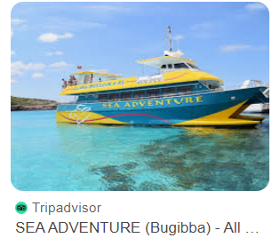
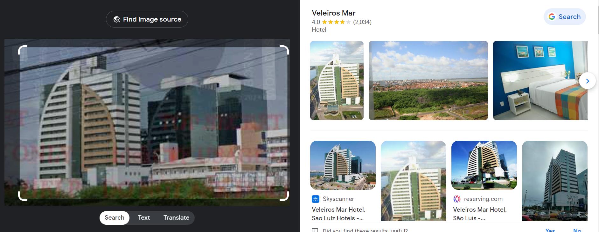
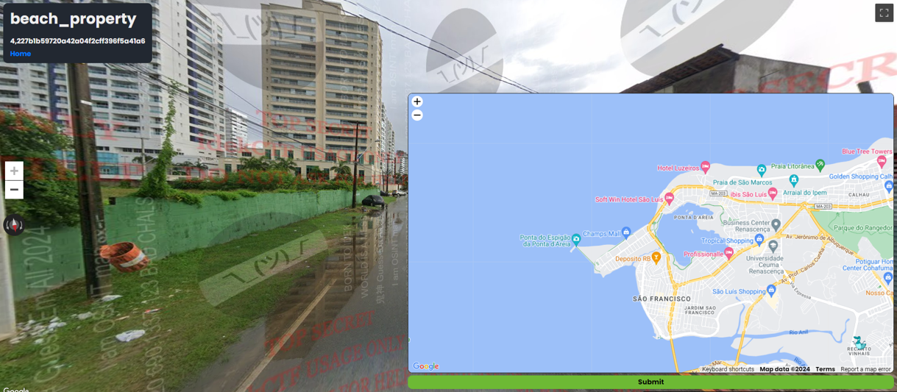
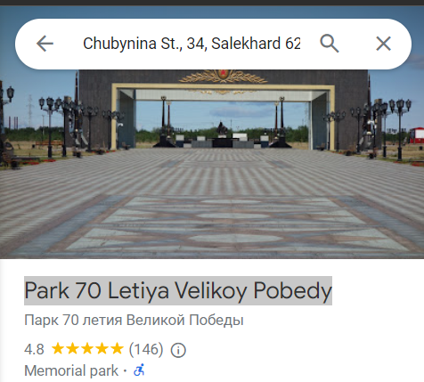

# soylent_green
By looking at the map, the language seen is thai. We also see a thai flag. So it is pretty clear we are in a Thai speaking country. We see a building with'phyath 2' readable on the side. I search and it is a hospital, the address is:  943 Phahonyothin Rd, Phaya Thai, Bangkok 10400, Thailand. As we need to pinpoint the area on the motorway beside the hospital, we need to locate the AH123 Motorway. We find the motorway and hospital lined up parallel.

**Flag 1:** 1,1755e5bcb85dc2786de932d826419f56

# and_my_compass
It is a coastal road, opposite is snow tipped mountains.
not really much else

# sea_adventure
A coastal tourism town. A boat with 'sea adventages' printed at the side is seen. We also see a green bus route. A towed boat parked by a car is covered but we can see it is called 'sea hawk'.
A 'FOR SALE' with missing digits is seen, those seen are '43 4107'. I couldn't make a lot out, tried to unblur digits/writing seen on the boats but it didn't work. So i searched 'Sea adventure tours orange boat' and found the exact boat seen on the water in the image. 

Location: Bugibba, Malta. By zooming around the coast on Google Maps, we can see the bus route and quickly pinpoint the location.

**Flag 3:** 3,5dd302f03e495b7a888a4b66686ccec0

# beach_property
We land in a clearly divided area. Rich on one side, poor on another. From my studies it appears to be  brazil.
I see a water tank with 'Fortlev' on it, I search it and my thought is confirmed, it is brazil

I see 'sa cavalcante' painted on the green division wall, I search it and it a brazilian real estate development company. I search the website but a lot of the properties are not located next to the coast or by a division line. So I screen grab the unqiue building seen, reverse image search it and its a hotel.

The hotels address is, Av. dos Holandeses, Ponta D'areia, Sao Luiz, 65075-650, Brazil. I then search lucio futevolei sao luis, I find an image on facevook titled luciano_futevolei.slz, I search luciano_futevolei and I get the location

**Flag 4:** 4,227b1b59720a42a04f2cff396f5a41a6

# stairway_to_heaven
Another coastal theme! I see coastal steps above a pictureque town. The landscape screams norway to me with the mountain views and small pointed coloured attached houses. I search 'stairs to viewpoint norway'. I find The port town of Ålesund, and find the location. 

**Flag 5:** 5,bcc9a94dd9b9026121dd4a7b5d106a87

# a_circle
There is a military landscape with a golden church shaped building and an ikea lookalike blue building to the other side. I look up the church, the tanks, plane and symbols i see but they are not unique enough to identify.
I also look at the dome, I reverse image search it and find Park 70 Letiya Velikoy Pobedy.

**Flag 6:** 6,b047238f02c1753e02473be44696319b

# idek_islands
A tropical coastal area. We see a 'no trespassing' sign. It very much feels carribean. 

# drunk_driving
A telegraph pole with id 'NR 10 166'. I looked up country code and could'nt find any that correspond to NR.
There is a chinese owned electric company that is called NR but their website is blocked in my country. 

# wrong_side

# pulled_over#
I think i saw this on grand tour! 

