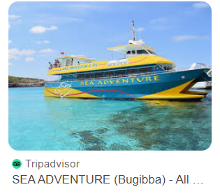
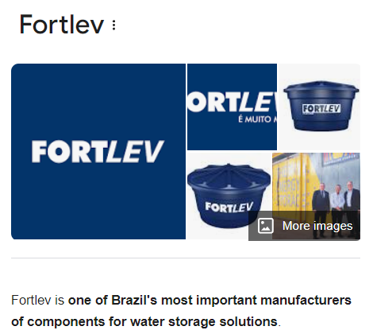
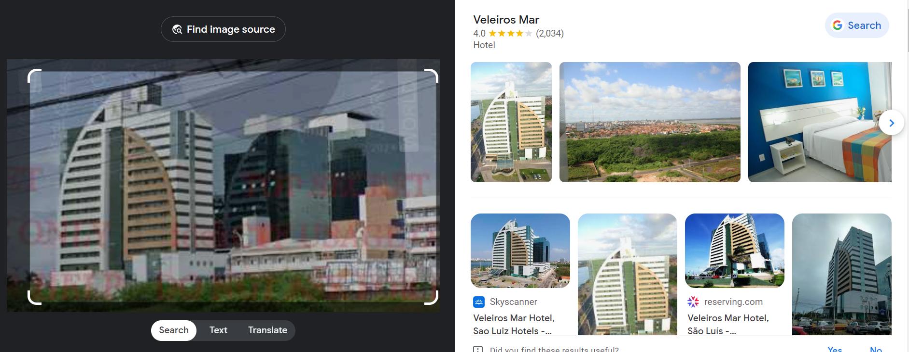
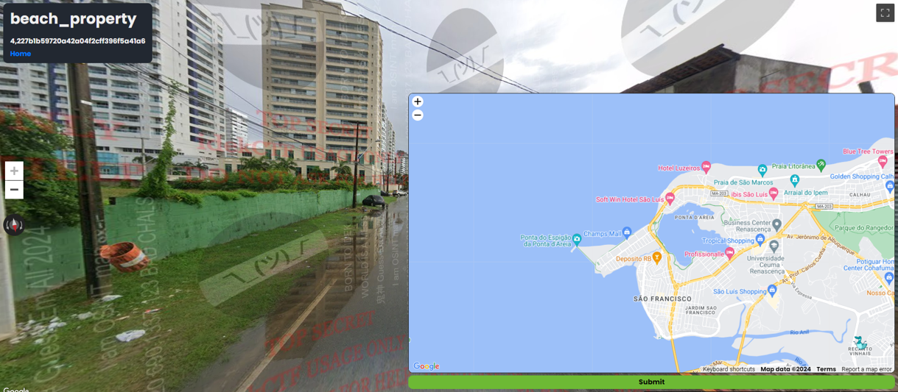
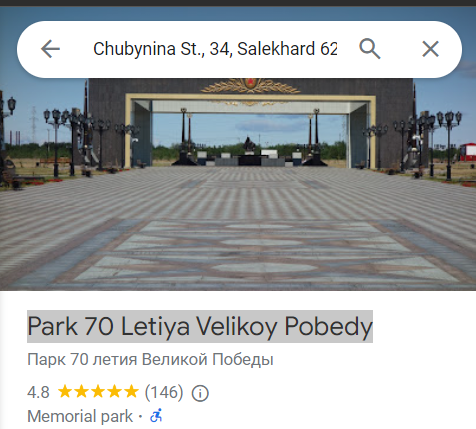

soylent_green
looking at the map, the language seen is thai
we also see a thai flag
'phyath 2' readable -> search and it is a hospital
943 Phahonyothin Rd, Phaya Thai, Bangkok 10400, Thailand
locate the AH123 Motorway
find the motorway and hospital lined up parallel
1,1755e5bcb85dc2786de932d826419f56

and_my_compass
coastal road
opposite is snow tipped mountains
not really much else

sea_adventure
coastal tourism town
boat with 'sea adventages' at the side
green bus route 
another towed boat covered and called 'sea hawk'
'FOR SALE' with missing digits, those seen are '43 4107'
couldn't make a lot out, tried to unblue images -  didn't work
searched 'Sea adventure tours orange boat' and found the boat

Location: Bugibba, Malta
go round the coast,
https://www.google.com/maps/@35.9509172,14.4090519,3a,60y,246.54h,84.88t/data=!3m6!1e1!3m4!1sSbmTAcVOBCziYtTzPY4cCw!2e0!7i13312!8i6656?coh=205409&entry=ttu
3,5dd302f03e495b7a888a4b66686ccec0

beach_property
We land in a clearly divided area
Rich on one side, slum on another
feels like brazil
i see a water tank with 'Fortlev' on it
search it - yep brazil

i see 'sa cavalcante' painted on the green division wall - i search it and it a brazilian real estate development company
i search the website but a lot of the properties are not located next to a shanti town
so i screen grab the unqiue building seen, reverse search it and its a hotel

Av. dos Holandeses, Ponta D'areia, Sao Luiz, 65075-650, Brazil
i then search lucio futevolei sao luis, i find an image on facevook titled luciano_futevolei.slz, i search luciano_futevolei and i get the location

4,227b1b59720a42a04f2cff396f5a41a6

stairway_to_heaven
coastal steps above a pictureque town
the landscape screams norway to me with the mountain views and small pointed coloured attached houses
i search 'stairs to viewpoint norway'
i find The port town of Ålesund
5,bcc9a94dd9b9026121dd4a7b5d106a87

a_circle
military landscape with a golden church shaped building and an ikea lookalike blue building to the other side
I look up the church, the tanks, plane and symbols i see but they are not unique enough to identify
i look at the dome, i reverse image search it and find Park 70 Letiya Velikoy Pobedy

6,b047238f02c1753e02473be44696319b

idek_islands
tropical coastal area
we see a 'no trespassing' sign

drunk_driving
telegraph pole with id 'NR 10 166'
i looked up country code and couldnt find any that correspond to NR
there is a chinese owned electric company that is called NR but their website is blocked in my country

wrong_side

pulled_over#
think i saw this on grand tour

