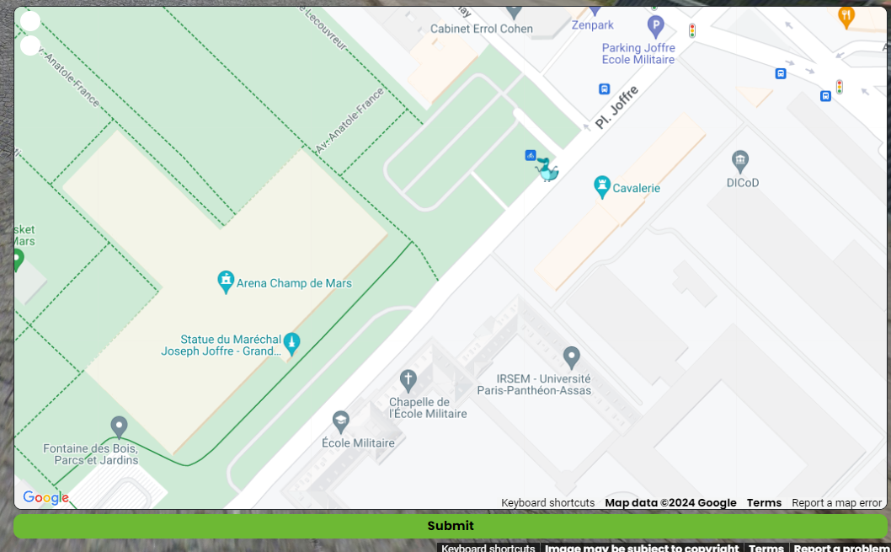
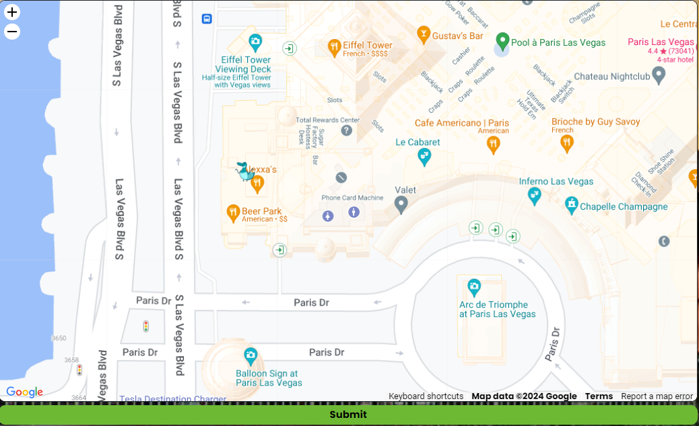
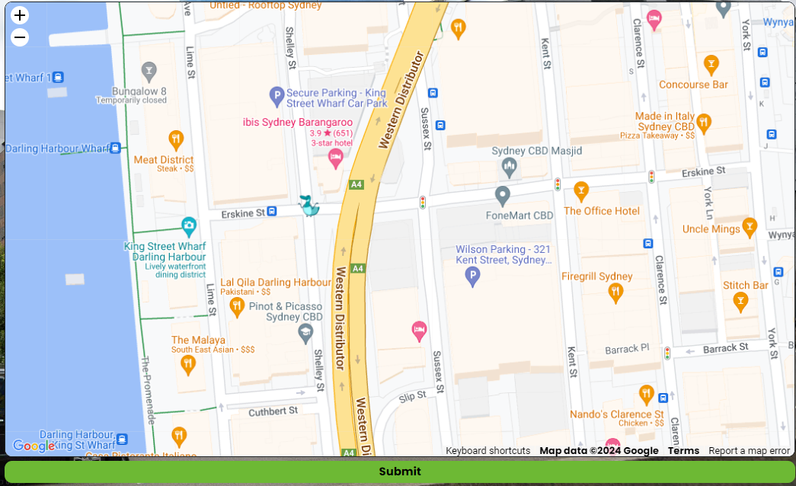
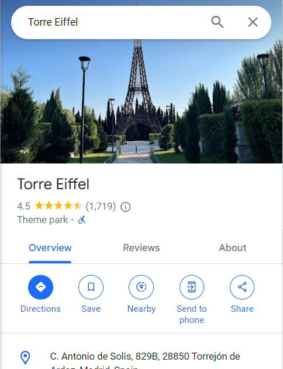

bonaparte_1784
identified effiel tower
https://www.google.com/maps/place/Cavalerie/@48.8536418,2.3047527,19z/data=!4m6!3m5!1s0x47e67021334c23c7:0xe76e6811837a102b!8m2!3d48.8535321!4d2.3049487!16s%2Fg%2F11fhrdc3v9?entry=ttu
1,1e3f2a0309b777b37b1bc12d01203339

beer_park
identified alexxias bar las vegas
https://www.google.com/maps/place/Alexxa's/@36.1117849,-115.1731761,18.56z/data=!3m1!5s0x80c8c43094c4819d:0x498c25bd56550acb!4m6!3m5!1s0x80c8c430ca8d7f7b:0xbabb8c203abf5fb0!8m2!3d36.1120228!4d-115.1725027!16s%2Fg%2F11b7fzct6l?entry=ttu
2,ec72b5bdb83f858308142a0d3dde5714

mr_drains
search mr drains plumbing from the van seen

location sydney
identified myob company building beside an ibis hotel - sydney

3,c82846bd8de1579487c290fe0ef30700

green_car
'atencion' sign = spanish
we see a monoment that resemables the effiel tower
search effiel tower replicas spain
https://www.wonders-of-the-world.net/Eiffel-Tower/Repliques/Replicas-of-the-Eiffel-tower-in-Spain.php
'Torrejon' city 'Torre Eiffel'

